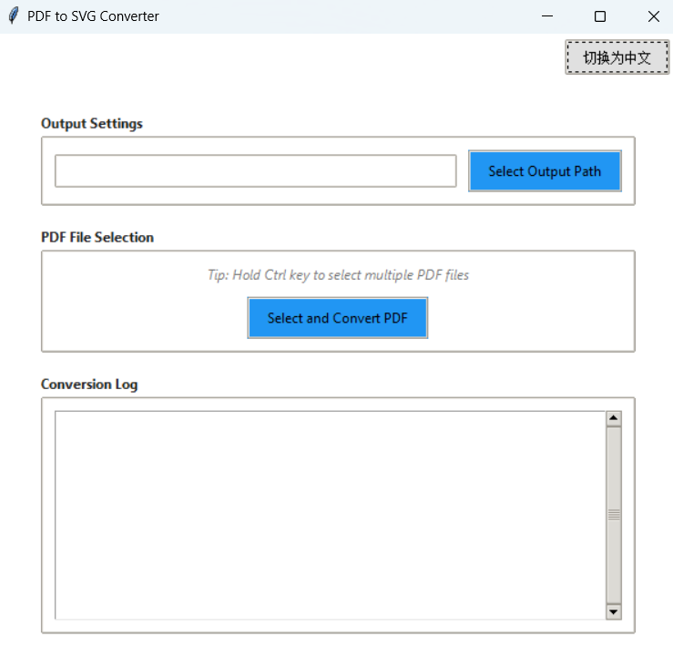

# pdf2svg-windows-GUI

[中文说明 (Chinese README)](README.zh.md)

## Project Overview
pdf2svg-windows-GUI is a Python-based graphical tool that allows users to batch convert PDF files to SVG vector images easily on Windows. Compared to the original pdf2svg.exe command-line tool, this project supports multilingual filenames (including Chinese) and provides a bilingual interface (English/Chinese), greatly improving usability and compatibility.

## Main Features
- **Graphical User Interface**: No command-line knowledge required, all operations can be completed through an intuitive window interface.
- **Batch Conversion**: Select multiple PDF files at once and convert them to SVG in batch.
- **Multilingual Filename Support**: Automatically handles non-ASCII filenames (such as Chinese), avoiding issues with the original tool.
- **Bilingual Interface**: Easily switch between English and Chinese interfaces to suit different user groups.
- **Custom Output Path**: Specify the output directory for SVG files.
- **Real-time Conversion Log**: Built-in log area displays conversion progress and errors in real time.

## Improvements Over Original pdf2svg.exe
- The original pdf2svg.exe only supports command-line operation and does not support non-ASCII filenames, making it inconvenient to use.
- This project wraps pdf2svg.exe, automatically handles filename encoding, and supports multiple languages.
- Provides a modern and user-friendly GUI suitable for all users.

## Installation & Running
1. **Requirements**:
   - Windows 10/11
   - pdf2svg.exe and all dependencies are included (no separate installation required)
   - It is recommended to use the packaged convertPDF2SVG.exe
2. **How to Run**:
   - Ensure both `pdf2svg.exe` and `convertPDF2SVG.exe` are in the same directory
   - Double-click `convertPDF2SVG.exe`

## How to Use
1. **Select Output Path**:
   - Click the "Select Output Path" button to specify the folder where SVG files will be saved.
2. **Select PDF Files**:
   - Click the "Select and Convert PDF Files" button. In the file selection dialog, hold Ctrl to select multiple PDF files.
3. **Start Conversion**:
   - Conversion starts automatically after selecting files. Progress and logs are displayed in the "Conversion Log" area below.
4. **Switch Interface Language**:
   - Use the button in the upper right corner to switch between English and Chinese interfaces.

## Project Structure

```markdown
convertPDF2SVG/
├── README.md                  # English documentation
├── README.zh.md               # Chinese documentation
├── .gitignore                 # Git ignore rules
├── config.json                # User configuration
├── release/                   # Release directory
│   ├── PDFToSVGConverter.exe  # Main executable
│   └── pdf2svg.exe            # Core converter
└── source/                    # Source code directory
    ├── build/                 # PyInstaller build files
    ├── dist/                  # PyInstaller output
    ├── convertPDF2SVG.py      # Main application code
    ├── create_icon.py         # Icon generator
    ├── pdf2svg.exe            # Core converter 
    ├── iconv.dll              # Character encoding
    ├── libbz2-1.dll           # Compression library
    ├── libcairo-2.dll         # Vector graphics
    ├── libfreetype-6.dll      # Font rendering
    ├── libjpeg-62.dll         # JPEG processing
    ├── libpng16-16.dll        # PNG processing
    └── ...                    # Other dependencies
```

## Notes
- The output directory must have write permissions.
- If conversion fails, please check the detailed error information in the log area.

## Screenshot Preview


## License
This project is licensed under the GPL License. Contributions and feedback are welcome.